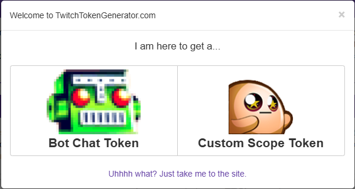
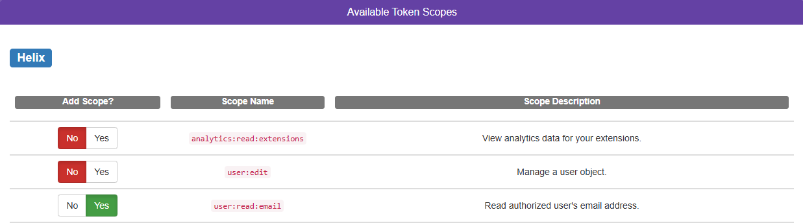
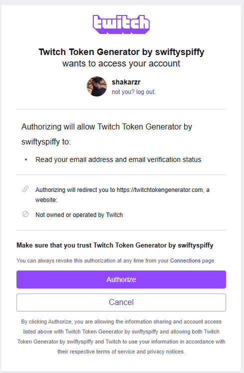

# Guía de configuración

## Obtención valores API

Lo primero que tenemos que hacer es ir a [twitchtokengenerator](https://twitchtokengenerator.com) y elegir **Custom Scope Token**

Luego bajamos hasta **Available Token Scopes** y seleccionamos el **user:read:email**

Luego solo tendremos que hacer scroll y darle al botón que pone **Generate Token** y esto nos pedira autorizaración de twitch. Al darle los consentimientos no volverá a la página de **twitchtokengenerator** y nos dará la info del **ACCESS TOKEN**, el **REFRESH TOKEN** y el **CLIENT ID**

## Configuración OBS

Lo primero será irnos a Paneles -> Paneles de navegador personalizados y nos crearemos uno nuevo, en la url, ponemos la ruta de nuestro pc donde tengamos el archivo **html** y le ponemos al final de la url `?mode=config`, por ejemplo asi quedaría: `file:///C:/Users/tuuser/Desktop/github/obs-views-count/contador-views.html?mode=config` y le damos a aplicar, esto nos sacara un panel de configuración, en el que tendremos que poner el **ACCESS TOKEN** y el **CLIENT ID**.

Lo segundo, tendremos que crear una nueva fuente de navegador, en la url pondremos lo mismo, la url al archivo en nuestro equipo, pero esta vez pondremos al final `?mode=counter`, de ancho pones **200** y de alto **50**.

Y listo, solo queda poner los nombres de usuarios de los canales de twitch y de **kick** y **listo** y darle a guardar.
